# KinoWita

Projekt zaliczeniowy z przedmiotu "Programowanie zaawansowane" - aplikacja webowa "System zarządzania siecią kin".

Technologie: PHP 8.2, Symfony 7.4, Doctrine ORM, MariaDB/MySQL, Twig, Tailwind CSS, Symfony UX (Stimulus, Turbo).

# Grupa Speedrun enginner 💸

- Seweryn Filipkowski 165666

- Wiktor Gronostaj 165812

- Adrian Wojciechowski 167079

## Uruchomienie projektu lokalnie

### Wymagania

Do uruchomienia projektu potrzebne są:

- PHP 8.2+
- Composer
- MySQL / MariaDB
- Symfony CLI opcjonalnie

Projekt nie wymaga Node.js. Style Tailwind CSS są budowane przez Symfony TailwindBundle.

---

### 1. Sklonowanie repozytorium

```bash
git clone ADRES_REPOZYTORIUM
cd KinoWita
```

### 2. Instalacja zależności PHP

```bash
composer install
```

### 3. Konfiguracja bazy danych

Utwórz plik .env w głównym katalogu projektu na podstawie .env.example

### 4. Utworzenie bazy danych

```bash
php bin/console doctrine:database:create
```

### 5. Uruchomienie migracji oraz seed danych testowych

```bash
php bin/console doctrine:migrations:migrate
php bin/console doctrine:fixtures:load
```

### 6. Zbudowanie styli Tailwind CSS

```bash
php bin/console tailwind:build
```

### 7. Uruchomienie aplikacji

```bash
php -S 127.0.0.1:8000 -t public
```

Opcjonalnie, jeśli zainstalowany jest Symfony CLI:

```bash
symfony server:start
```

### 8. Pełna kolejność komend

```bash
    composer install

    php bin/console doctrine:database:create
    php bin/console doctrine:migrations:migrate
    php bin/console doctrine:fixtures:load

    php bin/console tailwind:build

    php -S 127.0.0.1:8000 -t public
```

## Opis

Aplikacja obsługuje sieć kin: kilka placówek, z których każda ma własne sale i własny harmonogram seansów. Niezalogowany użytkownik przegląda repertuar i szczegóły filmów. Zalogowany klient rezerwuje miejsca z mapy sali i zarządza swoimi rezerwacjami. Pracownik prowadzi ofertę przypisanej placówki (seanse, sale, miejsca), a administrator nadzoruje całą sieć: filmy, placówki i konta użytkowników.

System ról decyduje o tym, co kto widzi i może zrobić. Dostęp do sekcji `/dashboard`, `/staff` i `/admin` pilnuje firewall Symfony, a pojedyncze akcje atrybut `IsGranted`.

## Funkcjonalności

### Dla wszystkich (także niezalogowanych)

1. **Repertuar** - przeglądanie seansów z filtrowaniem po placówce, gatunku i dacie.
2. **Wyszukiwanie filmów** - szukanie po tytule (dopasowanie bez rozróżniania wielkości liter).
3. **Szczegóły filmu** - opis filmu z listą najbliższych seansów.

### Dla zalogowanego klienta

4. **Rezerwacja miejsca** - wybór miejsca z mapy sali generowanej z układu rzędów i miejsc.
5. **Moje rezerwacje** - lista własnych rezerwacji.
6. **Anulowanie rezerwacji** - wycofanie wcześniej zrobionej rezerwacji.

### Dla pracownika placówki

7. **Zarządzanie seansami** - dodawanie i edycja seansów w przypisanej placówce, w tym powielanie seansu na kolejne dni.
8. **Zarządzanie salami** - tworzenie i edycja sal wraz z liczbą rzędów i miejsc w rzędzie.
9. **Podgląd rezerwacji** - wgląd w rezerwacje w przypisanej placówce.
10. **Statystyki placówki** - podsumowania dla przypisanej placówki.

### Dla administratora

11. **Zarządzanie filmami** - dodawanie i edycja filmów oraz przypisanie gatunku z listy.
12. **Zarządzanie placówkami** - tworzenie i edycja kin w sieci.
13. **Zarządzanie kontami** - zakładanie kont, nadawanie ról i przypisywanie pracowników do placówek.
14. **Statystyki sieci** - podsumowania dla całej sieci kin.

## Założenia techniczne

1. **Architektura MVC** - kod podzielony na kontrolery, encje, repozytoria, formularze i serwisy zgodnie ze strukturą Symfony.
2. **System ról** - trzy role (klient, pracownik, administrator), dostęp do widoków i akcji ograniczony po stronie serwera.
3. **Izolacja danych placówki** - pracownik operuje wyłącznie na placówce przypisanej do jego konta.
4. **Walidacja danych** - sprawdzanie poprawności w formularzach i encjach przed zapisem do bazy.
5. **Interfejs po polsku** - cała aplikacja w języku polskim.

## Uruchomienie

Wymagane: PHP 8.2+, Composer, MariaDB/MySQL, Symfony CLI.

Instalacja zależności:

```
composer install
```

Konfiguracja połączenia z bazą w `.env` (lub `.env.local`), domyślnie:

```
DATABASE_URL="mysql://root@127.0.0.1:3306/kino?serverVersion=mariadb-10.4.32&charset=utf8mb4"
```

Utworzenie bazy, migracje i dane startowe:

```
php bin/console doctrine:database:create
php bin/console doctrine:migrations:migrate
php bin/console doctrine:fixtures:load
```

Zbudowanie styli i start serwera:

```
php bin/console tailwind:build
symfony server:start
```

Alternatywnie `scripts/dev.sh` uruchamia budowanie Tailwinda w trybie watch razem z serwerem.

Konta startowe z fixtures (hasło dla wszystkich: `qwerty`):

- `admin@wsb.pl` - administrator
- `pracownik@wsb.pl` - pracownik (przypisany do placówki)
- `klient@wsb.pl` - klient

## Zrzuty ekranu

### Widok publiczny (dla wszystkich)

Strona główna z repertuarem (`/`):

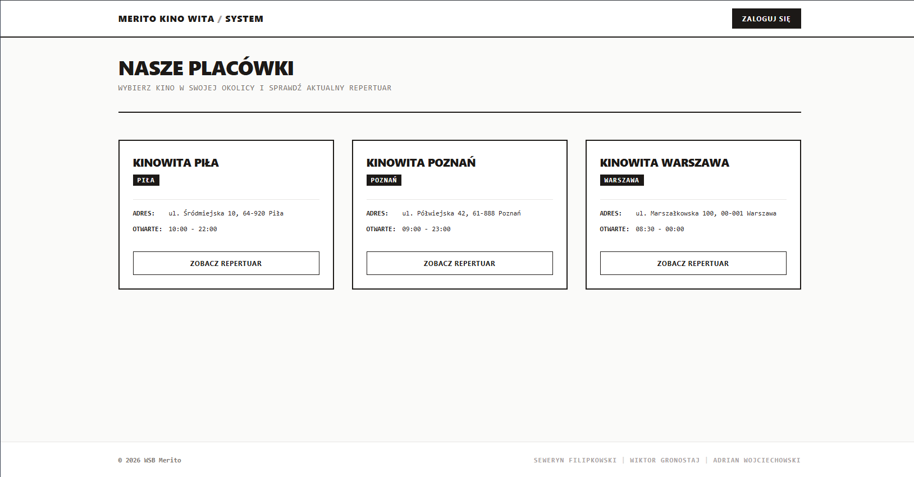

Logowanie (`/login`):

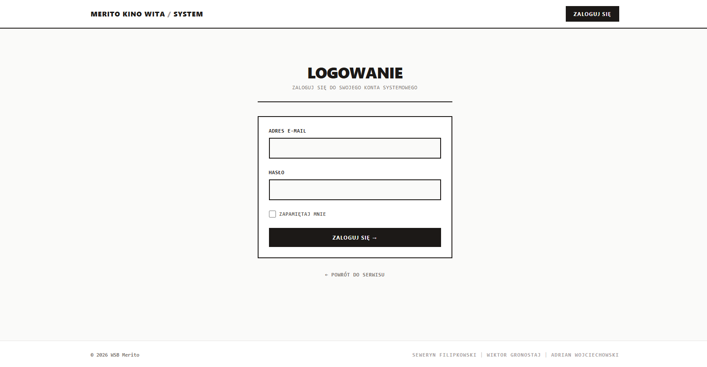

### Panel administratora

Pulpit administratora (`/admin`):

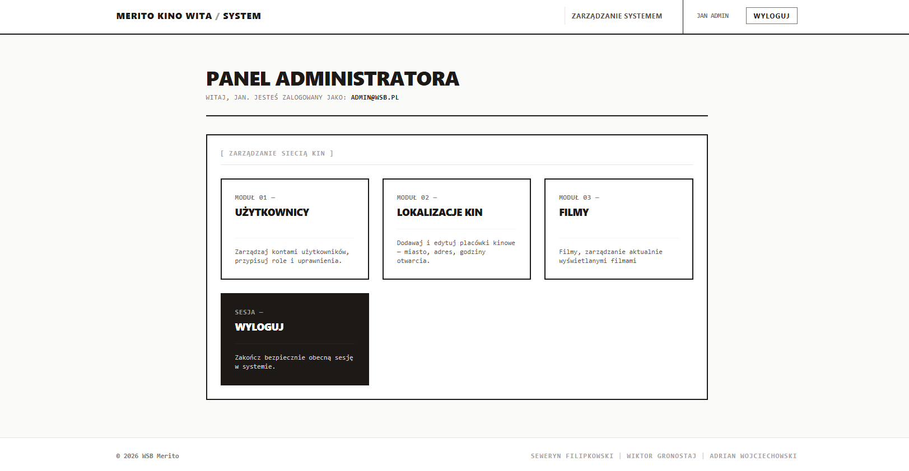

Zarządzanie kontami i przypisywaniem pracowników do placówek (`/admin/users`):

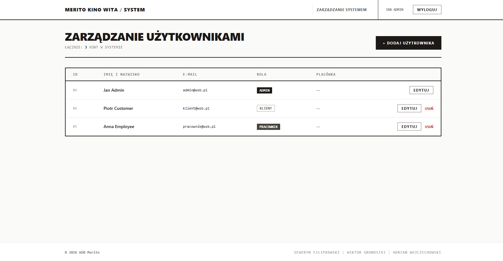

Zarządzanie placówkami (`/admin/cinemas`):

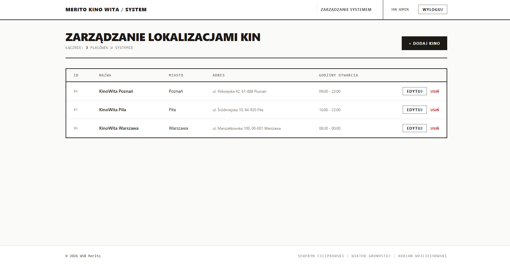

Zarządzanie filmami i gatunkami (`/admin/movies`):

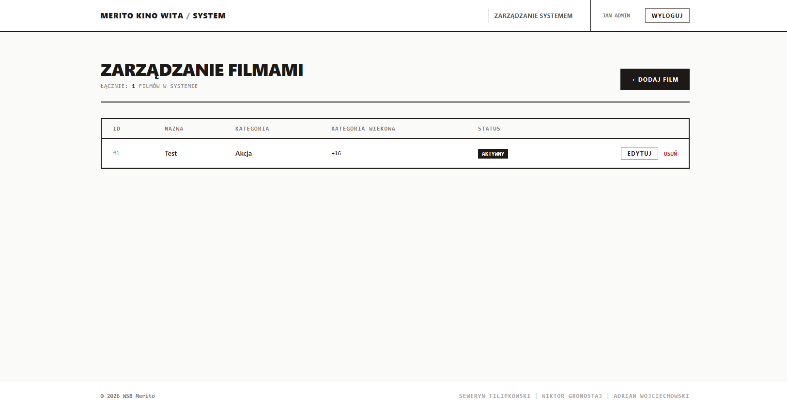

### Panel pracownika

Pulpit pracownika ze statystykami placówki (`/staff`):

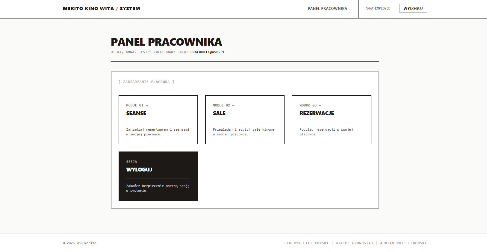

Zarządzanie salami (`/staff/halls`):

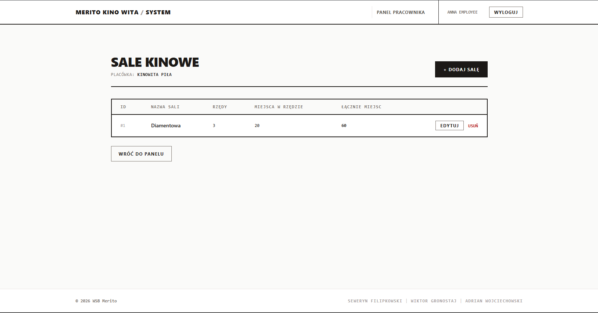

Zarządzanie seansami (`/staff/screenings`):

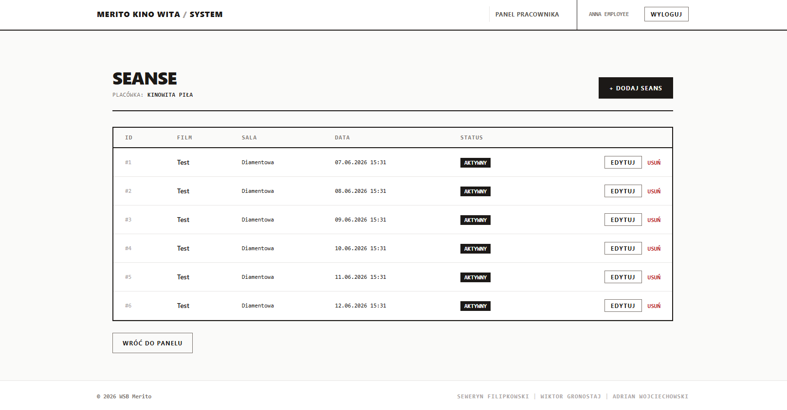

Zarządzanie rezerwacjami z poziomu pracownika placówki (`/staff/screenings`):

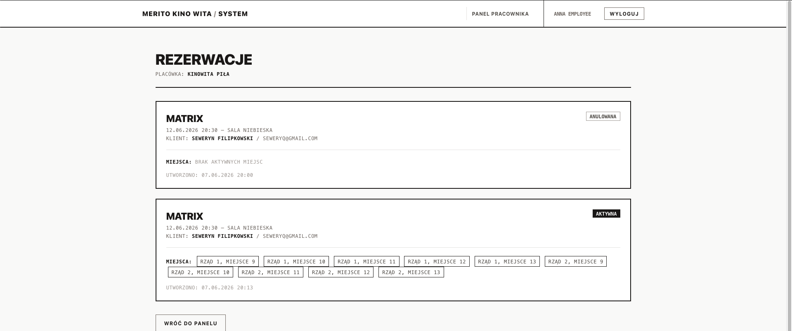

Widok filmów w danej placówce - mozliwosc filtracji oraz szukania (`cinemas/{id}/repertoire`):

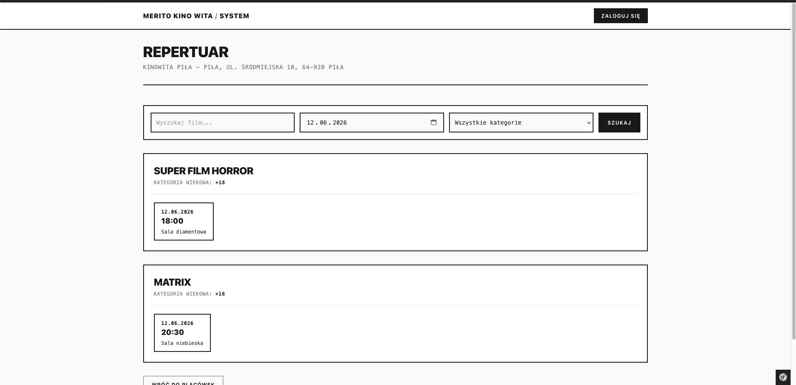

Rezerwacja miejsca na sali - niezalogowany uzytkownik (`/screenings/{id}/booking`):

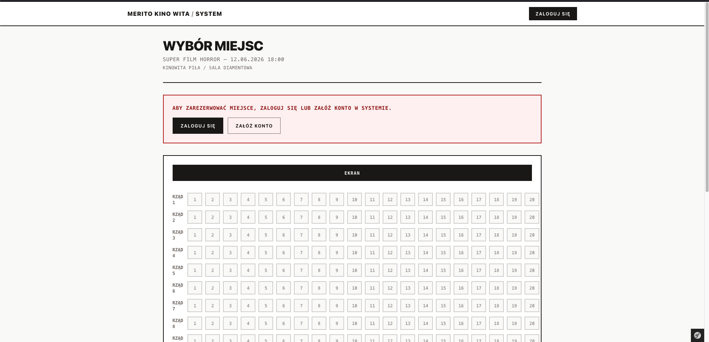

Rezerwacja miejsca na sali - zalogowany uzytkownik (`/screenings/{id}/booking`):

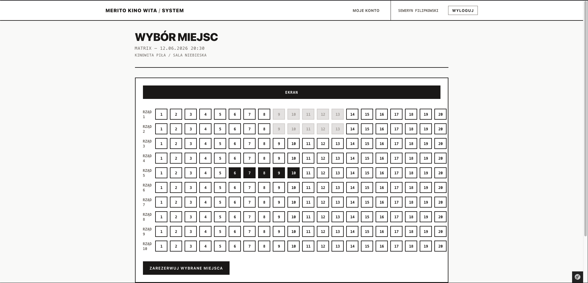

Rezerwacja miejsca na sali - zalogowany uzytkownik (`/screenings/{id}/booking`):


Widok moich rezerwacji (`user/reservations`):

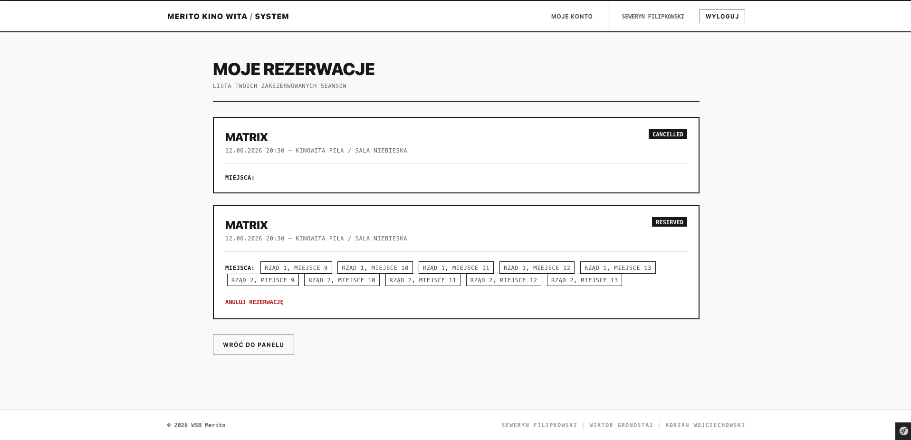

## Struktura kodu

Kod siedzi w `src/`:

- `src/Controller/` - kontrolery pogrupowane po obszarach (`Admin/`, `Staff/`, `User/`) oraz część publiczna (strona główna, repertuar, logowanie)
- `src/Entity/` - encje Doctrine
- `src/Repository/` - zapytania do bazy budowane QueryBuilderem (filtrowanie, sortowanie)
- `src/Form/` - typy formularzy (`Admin/`, `Staff/`)
- `src/Enum/` - typy wyliczeniowe (gatunek filmu)
- `src/Security/` - logowanie i obsługa odmowy dostępu z przekierowaniem zależnym od roli
- `src/Services/` - logika niezależna od kontrolera (m.in. tworzenie powtarzalnych seansów)
- `src/DataFixtures/` - dane startowe (placówki, konta)

Pozostałe katalogi: `templates/` (widoki Twig), `migrations/` (migracje Doctrine), `config/`, `public/`, `assets/`.

Wywołania idą tak: żądanie → kontroler → repozytorium/serwis → Doctrine → encja → szablon Twig.

## Struktura bazy danych

MariaDB/MySQL przez Doctrine ORM. Schemat wynika z atrybutów na encjach w `src/Entity/`, a zmiany schematu opisują migracje w `migrations/` (generowane przez `doctrine-migrations`).

### Tabele

**`user`** - konta użytkowników.

- `id`
- `email` (unikalny)
- `roles` (lista ról, JSON)
- `password` (hash)
- `first_name`
- `last_name`
- `cinema_id` (FK do `cinema`, nullable, `ON DELETE SET NULL`) - placówka przypisana pracownikowi

**`cinema`** - placówki sieci.

- `id`
- `name`
- `city`
- `address`
- `opening_hours` (nullable)

**`cinema_hall`** - sale w placówkach.

- `id`
- `name`
- `rows_count` - liczba rzędów
- `seats_per_row` - liczba miejsc w rzędzie
- `cinema_id` (FK do `cinema`, not null)

**`movie`** - filmy.

- `id`
- `name`
- `is_active`
- `age_category` - kategoria wiekowa
- `category` - enum gatunku: akcja, komedia, dramat, horror, animacja, familijny, sci-fi, dokumentalny, inne

**`screening`** - seanse.

- `id`
- `movie_id` (FK do `movie`, not null)
- `cinema_id` (FK do `cinema`, not null)
- `hall_id` (FK do `cinema_hall`, not null)
- `starts_at` - data i godzina rozpoczęcia
- `is_active`

**`reservation`** - rezerwacje użytkowników.

- `id`
- `screening_id` (FK do `screening`, not null)
- `user_id` (FK do `user`, not null)
- `status` - status rezerwacji, np. `reserved`, `cancelled`
- `created_at` - data utworzenia rezerwacji

**`reservation_seat`** - miejsca przypisane do konkretnej rezerwacji.

- `id`
- `reservation_id` (FK do `reservation`, not null)
- `screening_id` (FK do `screening`, not null)
- `rowNumber` - numer rzędu
- `seatNumber` - numer miejsca

Tabela posiada unikalne ograniczenie:

- `screening_id + rowNumber + seatNumber`

Dzięki temu jedno miejsce na konkretnym seansie nie może zostać zarezerwowane dwa razy.

### Relacje

- Placówka (`cinema`) ma wiele sal (`cinema_hall`) i wiele seansów (`screening`).
- Film (`movie`) ma wiele seansów.
- Sala (`cinema_hall`) ma wiele seansów.
- Seans łączy film, placówkę i salę (trzy relacje do jednego rekordu).
- Pracownik (`user`) jest przypisany do jednej placówki; klient i administrator nie mają przypisania.
- Użytkownik (`user`) może mieć wiele rezerwacji (`reservation`).
- Seans (`screening`) może mieć wiele rezerwacji (`reservation`).
- Rezerwacja (`reservation`) może zawierać wiele miejsc (`reservation_seat`).
- Miejsce rezerwacji (`reservation_seat`) należy do jednej rezerwacji i jednego seansu.
- Anulowanie rezerwacji zmienia jej status na `cancelled` oraz zwalnia przypisane miejsca.

Mapa miejsc na sali nie jest osobną tabelą: liczy się ją z `rows_count` i `seats_per_row` danej sali. Osobno zapisywane są tylko miejsca zarezerwowane w tabeli `reservation_seat`.
